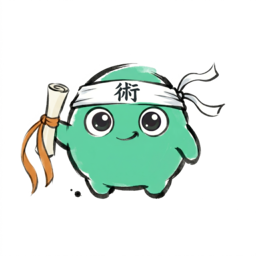

<p align="center">
  
</p>

<h1 align="center">kaijutsu</h1>

<p align="center">
  <strong>Open skills for AI coding agents.</strong><br>
  One source of truth — Claude, Codex, Gemini, all from the same registry.
</p>

<p align="center">
  <a href="https://kaijutsu.dev">kaijutsu.dev</a> ·
  <a href="./ROADMAP.md">Roadmap</a> ·
  <a href="./CONTRIBUTING.md">Contributing</a>
</p>

---

> **Status: pre-alpha.** Public scaffolding only. The `jutsu` CLI does not work yet. Star the repo to follow along.

## Why

Skills (markdown + scripts that extend AI coding agents) are exploding across Claude Code, Codex, and Gemini CLI. The good news: all three agents converge on the [Anthropic Agent Skills](https://agentskills.io) open standard, and Codex + Gemini both read from `.agents/skills/`. The bad news: nobody is curating a shared registry, and there is no easy way to keep the same toolkit in sync across all three agents.

**kaijutsu** is an MIT-licensed, agent-agnostic registry and CLI for AI agent skills. The CLI is named `jutsu`. One author manifest, two install paths (`.claude/skills/` for Claude, `.agents/skills/` for Codex + Gemini), three agents covered.

## How it will work (v0)

```bash
# Install jutsu
brew install momentmaker/tap/jutsu
# or
curl -fsSL https://kaijutsu.dev/install.sh | sh

# In any project
jutsu init                  # detects which agents you have installed
jutsu install pr-review     # writes to .claude/skills/ and/or .agents/skills/
jutsu list
jutsu upgrade

# Globally
jutsu install -g unstuck
```

A skill lives in this repo (or any third-party repo registered in `registry/index.json`) as a directory:

```
skills/core/pr-review/
  skill.yaml          # kaijutsu metadata (name, version, license, perms, agents[])
  SKILL.md            # Anthropic Agent Skills standard — works for all three agents
  scripts/            # optional shared executables
  README.md
```

Most skills only need a single `SKILL.md`. For the rare cases where Claude and Codex need different content, drop a per-agent override under `overrides/<agent>/SKILL.md`. See [`SCHEMA.md`](./SCHEMA.md) and [`docs/multi-agent.md`](./docs/multi-agent.md) for the full reference.

## v0 seed skills

`pr-review` · `readme-update` · `decide` · `journal` · `polish` · `unstuck` · `scope-check` · `session-retro` · `agent-doctor`

## Trust model

- **Core skills** (this monorepo, `skills/core/`) are signed at release time using [Sigstore](https://www.sigstore.dev/) keyless signing. The CLI verifies the signature and the GitHub identity of the signer before installing.
- **Community skills** (third-party repos registered in `registry/index.json`) are unsigned by default. The CLI prompts the user when a skill declares sensitive permissions (shell, network, filesystem write).
- Every skill ships a permission manifest in `skill.yaml`.

## Contributing

See [`CONTRIBUTING.md`](./CONTRIBUTING.md). Skill authors can submit a PR to `skills/community/` or register a third-party repo in `registry/index.json`. All contributions must be MIT-licensed (or compatible: BSD-2/3, ISC, Apache-2.0).

## License

MIT. See [`LICENSE`](./LICENSE).

The name *kaijutsu* is a play on **kaiju** (怪獣, "strange beast") and **jutsu** (術, "technique") — also reads as "open / mysterious arts." The mascot is an original chibi monster, unaffiliated with Toho's Kaiju properties.
