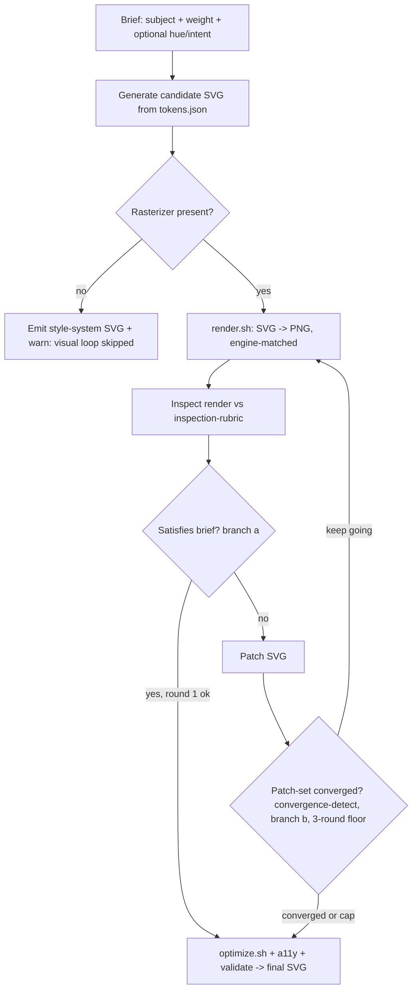
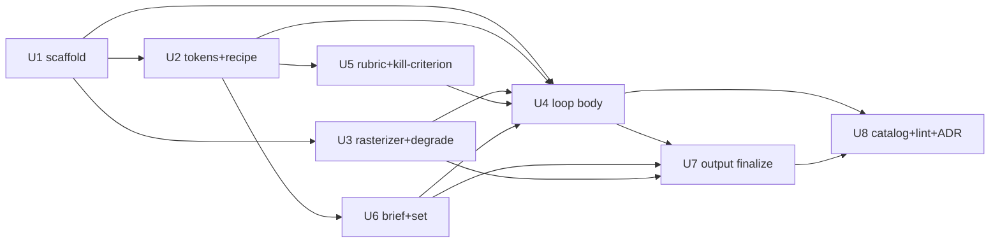

# feat: SVG icon generation via a render-see-fix loop (svg skill)

## Summary

Ship a new core kaijutsu skill, `svg`, that generates premium, dimensional SVG icons via a render-see-fix loop (generate → rasterize → inspect against a concrete quality rubric → patch → converge) driven by a data-driven house-style token system with a flat→dimensional weight dial. Built as a **concrete, factorable icon loop** — not a frozen generic primitive interface — so it honors AGENTS.md "don't build beyond the stage" while keeping the loop cleanly extractable into a shared primitive when a second consumer (charts/diagrams) lands.

---

## Problem Frame

A generic agent generates SVG ad-hoc and *blind*, producing flat/generic icons and costing several re-rolls. The fix is a missing style system (for "flat") and a missing feedback loop (for "several tries"). Full motivation, actors, flows, and the house-style research live in the origin requirements doc (see Sources & References).

---

## Requirements

- R1. Render-see-fix loop (generate → rasterize → inspect → patch → re-render).
- R2. Keep the loop **concrete but factorable** — a self-contained loop section + scripts that can be extracted into a shared primitive later. *This deliberately narrows origin R2 (which specified a generic artifact-agnostic interface up front); that interface is deferred — see Scope Boundaries → Deferred to Follow-Up Work.*
- R3. Stop on first of: (a) render satisfies the brief (round-1 terminable, new in-skill logic), or (b) no meaningful improvement (gated by `convergence-detect` on the patch-set, 3-round floor); hard iteration cap as safety boundary.
- R4. Graceful degrade when no rasterizer — emit style-system output, report the visual pass was skipped, never hard-fail.
- R5–R10. House-style token system: data-driven tokens (geometry, palette, gradient, depth) shared across a set; keyline grid + constant radius/stroke; procedural palette lanes; linear body + off-center radial highlight; layered depth compositing; weight dial scaling only the depth-stack; set cohesion via one token source.
- R11. Output is well-formed, optimized SVG (optimize after the loop), vector-paths-only, a11y per intent.
- R12. Agent-agnostic single `SKILL.md`, no swarm.
- R13–R15. Brief/input schema; set brief; anti-AI-slop guardrail + characterized premium reference.
- **Success criteria:** concrete visual-quality rubric (the loop's stop input); falsifiable loop-vs-ad-hoc kill-criterion; inspection-reliability calibration gate.

**Origin actors:** A1 (invoking agent), A2 (human author), A3 (rasterizer).
**Origin flows:** F1 (single icon render-see-fix), F2 (cohesive set), F3 (degraded run).
**Origin acceptance examples:** AE1 (covers R4), AE2 (R9 flat), AE3 (R1, R3), AE4 (R10), AE5 (R9 soft), AE6 (R12), AE7 (R13).

---

## Scope Boundaries

### Deferred for later

*(carried from origin — product sequencing)*

- Charts / diagram consumers of the loop.
- Animation / "dynamic" motion (SMIL / CSS keyframes).

### Outside this product's identity

*(carried from origin — positioning rejection)*

- Training or matching a specialized SVG model (Arrow 1.0); the edge is the loop + style system.
- Raster image → SVG vectorization / tracing.
- A swarm / multi-agent generation variant.
- A general third-party brand-theming engine beyond the weight dial.

### Deferred to Follow-Up Work

*(plan-local — implementation sequencing)*

- **Generic artifact-agnostic primitive interface (R2 promotion).** v1 ships a concrete, factorable icon loop; extract a shared `visual-convergence` primitive when a second consumer (charts/diagrams) actually constrains the interface. Resolves the origin's [P1] premature-abstraction flag.
- **Identity-fit reconfirm + Arrow-inversion analysis** (origin Deferred / Open Questions) — fold into the ADR before tagging.

---

## Context & Research

### Relevant Code and Patterns

- `SCHEMA.md`, `schemas/skill.schema.json` — skill.yaml contract (required: `name, version, license, layout, description, agents, permissions`; `additionalProperties: false`; SKILL.md frontmatter `name` must equal `skill.yaml:name`).
- `skills/core/convergence-detect/{SKILL.md,skill.yaml}` — the primitive composed for branch (b); text-drift only, **3-round floor**, cannot judge a render. Permissions triple `{bash:true, network:false, fs-write:scoped}` to mirror.
- `skills/core/polish/SKILL.md` — exemplar of composing `convergence-detect` via `deps.skills: [convergence-detect@^0.2]` + inline invocation.
- `skills/core/autopilot/`, `skills/core/pr-review/` — rich-layout exemplars (`layout: rich`, `shared: [...]`, `scripts/`, `references/`).
- `skills/community/dcg/hooks/dcg.sh` — the graceful-degrade `command -v` fallback pattern (model R4 on this, NOT the hard-fail wrappers in `brainstorm/pr-review/scripts/run.sh`).
- `cli/internal/cli/install.go` (`confirmPermissions`, `sensitivePermissions`) — only `bash:true` / `network:true` / `fs-write:full` prompt at install; `fs-write:scoped` does not.
- `cli/cmd/sitegen/main.go` + `.github/workflows/lint-skills.yml` — catalog regen (`cd cli && go run ./cmd/sitegen ..` writes `docs/skills.json` + `docs/index.html`); **PR catalog-drift check is strict** (fails on drift); push-to-main auto-regens. lint also requires a sibling `SKILL.md` per `skill.yaml`.
- `.github/workflows/sign-core.yml` — CI signs each `skills/core/*/` on tag; authors never self-assert `signed:true`, only declare `trust.expected-signer`.

### Institutional Learnings

- `docs/decisions/2026-05-05-driver-abstraction.md` — make an absent external binary a **first-class branch with a visible warning**, not a silent fallback (apply to R4).
- `docs/decisions/2026-05-07-dream-skill-and-preset.md` — precedent for adding a new skill: don't speculate structure ahead of evidence (encode in existing fields until usage justifies migration); follow the dogfood loop (spec → `jutsu swarm doc-review` → fix → ship → polish → adversarial `pr-review` → tag).
- No `docs/solutions/` tree exists; ADRs/specs/brainstorms are the learning corpus.

### External References

- House-style techniques (gradients, depth compositing, grids, palettes, DTCG tokens) are captured in the origin requirements doc, grounded by the deep-research report (MDN, W3C, Material 3, Microsoft Learn, DTCG). Note the verified correction: premium dimensionality comes from **layered compositing**, not `feSpecularLighting` alone.

---

## Key Technical Decisions

- **Concrete factorable loop over a generic primitive interface (defers R2):** user decision + AGENTS.md "don't build beyond the stage" + three reviewers. Keep the loop logic self-contained (one SKILL.md section + `scripts/`) so extraction is cheap later.
- **Compose `convergence-detect` for the patch-set branch only:** it is a text-drift detector with a 3-round floor; the render-vs-brief visual-satisfaction check is new in-skill logic that can terminate at round 1. Mirrors origin R3 and `polish`'s composition shape.
- **Rich layout** (`layout: rich`, `shared: [references, assets, scripts]`): the token source, recipes, anti-slop guidance, and rasterize/optimize scripts justify it. Peers: `pr-review`, `dream`, `autopilot`.
- **Permissions `{bash:true, network:false, fs-write:scoped}`:** identical triple to `convergence-detect`; only `bash` prompts at install. Avoid `fs-write:full` (zero precedent in the repo).
- **Graceful degrade** modeled on `dcg.sh` + driver-abstraction ADR — detect rasterizer, take the visual path when present, emit a visible "visual loop skipped" warning when absent.
- **Rasterizer engine-match to target (R8):** the in-loop rasterizer must match the engine family the SVG ships to, or the recipe avoids divergent filter primitives — so an approved render predicts the user's browser.
- **DTCG composite `gradient` + `shadow` as the leading token format,** finalized against what the loop actually consumes (softened from a hard prescription per review).
- **`trust.expected-signer: kaijutsu-core@github`;** CI signs on tag, never self-asserted.

---

## Open Questions

### Resolved During Planning

- Primitive-first vs concrete loop → **concrete, factorable** (user + reviewers + AGENTS.md).
- Layout flat vs rich → **rich**.
- Permissions → `{bash:true, network:false, fs-write:scoped}`.
- Rasterizer fidelity → resolved as an **engine-match constraint** (R8); the specific binary is deferred to implementation.
- Skill placement → **assume `skills/core/`** (per origin signing/ceremony assumptions); reconfirm core-vs-community/personal with the maintainer before tagging (origin [P1]).
- Skill name → **`svg`** (umbrella name; accommodates charts/diagrams later) per the user's explicit ask.

### Deferred to Implementation

- Exact rasterizer binary (resvg-js vs rsvg-convert vs headless chromium vs cairosvg) — chosen in U3 against engine-match + install weight.
- Final token schema field layout — refined in U2 against what the loop consumes.
- Concrete gradient/depth recipe numeric values — research gives the structure; exact values tuned visually in the loop (U2/U4).
- Calibration agreement rate + kill-criterion A/B threshold — set when the eval harness exists (U5).

---

## Output Structure

    skills/core/svg/
      skill.yaml                  # rich layout, permissions, deps[convergence-detect], trust
      SKILL.md                    # the loop body (F1/F2/F3), composition, output
      README.md                   # short install/compose blurb
      references/
        house-style.md            # geometry/palette/gradient/depth recipe + weight dial + anti-slop
        inspection-rubric.md      # visual-quality checklist + kill-criterion + calibration gate
        brief-schema.md           # R13/R14 input contract
      assets/
        tokens.json               # DTCG-leaning token source (one style source per set)
      scripts/
        render.sh                 # rasterizer probe + svg->png, engine-match, degrade
        optimize.sh               # svgo, after-loop, skip-with-note if absent
      evals/                      # minimal labeled calibration set (owned by U5), not a harness
    docs/
      index.html                  # regenerated by sitegen (catalog)
      skills.json                 # regenerated by sitegen (catalog)
      decisions/
        2026-06-14-NNN-svg-visual-convergence.md   # ADR

---

## High-Level Technical Design

> *This illustrates the intended approach and is directional guidance for review, not implementation specification. The implementing agent should treat it as context, not code to reproduce.*

Dependency graph for the units:

---

## Implementation Units

### U1. Scaffold the `svg` skill manifest + skeleton

**Goal:** Create the rich-layout skill shell so the registry recognizes it and CI lint passes.

**Requirements:** R2, R12

**Dependencies:** None

**Files:**
- Create: `skills/core/svg/skill.yaml`
- Create: `skills/core/svg/SKILL.md` (frontmatter `name: svg` + section skeleton)
- Create: `skills/core/svg/README.md`

**Approach:**
- `layout: rich`, `shared: [references, assets, scripts]`, `tags: [primitive, svg, icons]`.
- `permissions: {bash: true, network: false, fs-write: scoped}`.
- `deps.skills: [convergence-detect@^0.2]`.
- `trust.expected-signer: kaijutsu-core@github`.
- SKILL.md frontmatter `name` must equal `skill.yaml:name` (`svg`); description carries trigger phrases ("generate an SVG icon", "make an icon", "icon set").
- Validate the manifest manually with `ajv validate` against `schemas/skill.schema.json` — CI only compiles the schemas and checks for a sibling `SKILL.md`; it does not validate skill.yaml field shapes (`shared` / `permissions` / `deps` / `trust`), and the Go loader's `Validate()` checks only `name`/`version`/`license`/`layout`/`agents`/`hooks`.

**Patterns to follow:**
- `skills/core/autopilot/skill.yaml` (rich manifest), `skills/core/convergence-detect/skill.yaml` (permissions triple), `schemas/skill.schema.json`.

**Test scenarios:**
- Test expectation: none (scaffolding) — verified by schema validation (`schemas/skill.schema.json`) and `lint-skills.yml` SKILL.md-presence check.

**Verification:**
- `lint-skills` passes locally (it checks for a sibling `SKILL.md`, not skill.yaml-vs-schema); the manifest is validated **manually** against `schemas/skill.schema.json` (e.g. `ajv validate -s schemas/skill.schema.json -d skills/core/svg/skill.yaml -c ajv-formats`), since CI does not run that check; `go run ./cmd/sitegen ..` loads the manifest without error; `name` fields match.

---

### U2. House-style token system + recipe + weight dial + anti-slop

**Goal:** Encode "what premium looks like" as data + a recipe the loop applies, so a set is cohesive and not generic.

**Requirements:** R5, R6, R7, R8 (recipe), R9, R10, R15

**Dependencies:** U1

**Files:**
- Create: `skills/core/svg/assets/tokens.json`
- Create: `skills/core/svg/references/house-style.md`

**Approach:**
- Tokens: geometry (24 keyline grid, radius 2, stroke 2), palette (procedural tonal lanes from a base hue; gradient pairs = adjacent lane steps at a consistent ~120° angle), gradient (linear body fill + off-center radial highlight focal point), depth (soft drop shadow via blur→offset→merge + body gradient + radial highlight + dark/light bevel edges). DTCG composite `gradient` + `shadow` as the leading shape.
- Weight dial mapping: `flat` = no depth-stack; `soft` = reduced (e.g. soft shadow + body gradient, bevel/highlight omitted or reduced); `dimensional` (default) = full stack. Geometry/palette/cohesion constant across weights.
- Anti-slop guardrail (R15): a characterized premium reference + at least one structural rule (deliberate asymmetry / off-center balance / a signature element); call out that uniform shadow+gloss+bevel across a set is itself the slop signature.
- Depth is **layered compositing**, explicitly NOT `feSpecularLighting` alone (research-verified).

**Patterns to follow:**
- DTCG draft token shapes; origin requirements doc R5–R10, R15.

**Test scenarios:**
- Covers AE2. Happy path: `weight=flat` token application omits the depth-stack but keeps grid/stroke/palette.
- Covers AE5. Happy path: `weight=soft` yields a reduced depth-stack visibly distinct from flat and dimensional.
- Edge case: two icons in one set resolve the same token source → identical grid/stroke/lane.

**Verification:**
- `tokens.json` parses; `house-style.md` defines each weight's depth-stack composition unambiguously; an icon at each weight is reproducible from the tokens alone.

---

### U3. Rasterizer + optimizer scripts with graceful degrade

**Goal:** Give the loop eyes (SVG→PNG) and a clean output pass, without making either a hard dependency.

**Requirements:** R4, R8, R11 (optimize-after-loop)

**Dependencies:** U1

**Files:**
- Create: `skills/core/svg/scripts/render.sh`
- Create: `skills/core/svg/scripts/optimize.sh`

**Approach:**
- `render.sh`: probe `command -v` for the chosen rasterizer (resvg / rsvg-convert / headless browser); engine-match the target family (R8); on absence, exit with a status the SKILL.md reads as "skip the visual pass" + a visible warning (model on `dcg.sh`, NOT the hard-fail wrappers).
- `optimize.sh`: run svgo (or equivalent) **after** the loop; skip-with-note if absent.
- SPDX MIT header on each `.sh`.

**Execution note:** Model the absent-tool branch on `skills/community/dcg/hooks/dcg.sh`'s `command -v` fallback; surface absence as a first-class, visible branch per the driver-abstraction ADR.

**Patterns to follow:**
- `skills/community/dcg/hooks/dcg.sh`, `docs/decisions/2026-05-05-driver-abstraction.md`.

**Test scenarios:**
- Covers AE1. Error path: rasterizer absent → emit style-system SVG, report "visual loop skipped", exit non-error.
- Happy path: rasterizer present → SVG rasterizes to PNG the agent can read.
- Edge case: optimizer absent → output still emitted, with a note.

**Verification:**
- With the rasterizer removed from PATH, a run completes and reports the skip; with it present, a PNG is produced.

---

### U4. The render-see-fix loop body (SKILL.md)

**Goal:** The core behavior — generate, see, fix, converge — encoded as agent-readable instructions.

**Requirements:** R1, R2 (concrete/factorable), R3

**Dependencies:** U1, U2, U3, U5, U6

**Files:**
- Modify: `skills/core/svg/SKILL.md` (loop section + F1/F2/F3)

**Approach:**
- Generate candidate from `tokens.json` → `render.sh` → inspect against `inspection-rubric.md` → patch → re-render.
- Branch (a) render-satisfies-brief: new in-skill logic, round-1 terminable, no floor.
- Branch (b) no-improvement: invoke `convergence-detect` on the **patch-set** (are successive SVG edits restating each other), honoring its 3-round floor; inline-invoke like `polish`.
- Hard iteration cap as a safety boundary.
- Emit a JSON sidecar of loop state per the agent-first lens (markdown-on-TTY / JSON-on-pipe), `lower_snake_case` per SCHEMA.md, with at least `{"skill": "svg", "schema_version": "<semver>", "round": N, "verdict": "converged|capped|skipped", "stop_branch": "a|b|none"}`.
- Keep the loop in one self-contained section so it is extractable later (R2 factorability).

**Technical design:** see the flowchart in High-Level Technical Design — directional, not implementation spec.

**Patterns to follow:**
- `skills/core/polish/SKILL.md` (inline `convergence-detect`), `convergence-detect/SKILL.md` output shape, `SCHEMA.md` JSON sidecar (`skill` + `version`, `lower_snake_case`).

**Test scenarios:**
- Covers AE3. Happy path: first render misses the brief → loop patches and re-renders until it converges or hits the cap.
- Edge case: cap reached without satisfaction → loop stops at the cap and reports best effort.
- Integration: branch (b) only fires after round 3 (convergence-detect floor); branch (a) can stop at round 1.

**Verification:**
- A brief yields a converged SVG on a render the agent inspected; the loop never exceeds the cap; branch precedence behaves per R3.

---

### U5. Inspection rubric + quality bar + kill-criterion + calibration gate

**Goal:** Make "premium enough" observable so the loop has a real stop signal and the bet is falsifiable.

**Requirements:** R1, R3 (referenced); Success Criteria — rubric, kill-criterion, calibration gate

**Dependencies:** U2

**Files:**
- Create: `skills/core/svg/references/inspection-rubric.md`
- Create: `skills/core/svg/evals/` — a handful of pre-labeled good/flawed icon + verdict pairs for the calibration probe (a small labeled set, not a harness)
- Modify: `skills/core/svg/SKILL.md` (reference the rubric from the inspect step)

**Approach:**
- Concrete checklist the inspect step applies (at dimensional weight: body gradient present, non-zero shadow offset, visible bevel/highlight edge, on-grid) — this is what "satisfies the brief" means for the depth dimension.
- Kill-criterion: a blind comparison where humans prefer loop output over single-shot ad-hoc at a planning-set threshold; if not met, ship style-system-only.
- Calibration gate: a probe confirming the agent's render-critique agrees with human judgment on pre-labeled good/flawed icons above a planning-set rate.

**Patterns to follow:**
- Origin Success Criteria; `scope-check`/`convergence-detect` literal-checklist house style.

**Test scenarios:**
- Happy path: rubric flags a flat solid-fill icon as failing at dimensional weight.
- Integration (eval): calibration set where the agent's pass/fail labels are scored against human labels.

**Verification:**
- The rubric is concrete enough that two implementers reach the same pass/fail on the same render; calibration + kill-criterion thresholds are named (values filled at eval time).

---

### U6. Brief / input contract + set cohesion

**Goal:** Define how a human expresses intent so a planner/agent doesn't invent the input surface.

**Requirements:** R7 (hue origin), R10, R13, R14

**Dependencies:** U1, U2

**Files:**
- Create: `skills/core/svg/references/brief-schema.md`
- Modify: `skills/core/svg/SKILL.md` (F2 set flow)

**Approach:**
- Brief schema: required `subject`, `weight` (default `dimensional`); optional `base hue`/semantic, `size`, `background lightness`, `intent` (`decorative` | `semantic`). Base hue feeds R7's palette lane; documented default lane when absent.
- Set brief: a list of subjects sharing one hue + weight in a single invocation, so the shared token source (R10) is derived before generation.

**Patterns to follow:**
- Origin R13/R14; `tokens.json` lane derivation from U2.

**Test scenarios:**
- Covers AE7. Edge case: brief missing base hue → documented default lane, not a per-icon inconsistent hue.
- Covers AE4. Integration: set brief of N subjects → all share one token source, read as a family.

**Verification:**
- A brief with only `subject` produces a valid icon via defaults; a set brief produces a cohesive family from one derived token source.

---

### U7. Output finalization — optimize, a11y, validate

**Goal:** Ship clean, accessible, well-formed SVG.

**Requirements:** R11

**Dependencies:** U4, U6, U3 (optimizer)

**Files:**
- Modify: `skills/core/svg/SKILL.md` (output section)

**Approach:**
- Run `optimize.sh` after the loop (never mid-loop).
- a11y by `intent` (R13): `semantic` → `<title>` from subject + role; `decorative` → `aria-hidden="true"`, omit title.
- Validate: vector-paths-only, no embedded rasters, well-formed.

**Patterns to follow:**
- Origin R11; `optimize.sh` from U3.

**Test scenarios:**
- Happy path: semantic icon carries a `<title>` from the subject; decorative icon sets `aria-hidden` and omits title.
- Edge case: output contains no embedded raster and parses as well-formed SVG.

**Verification:**
- Final SVG is optimized, path-only, and carries the correct a11y branch for the brief's `intent`.

---

### U8. Catalog regen + lint/CI green + ADR + agent-agnostic check

**Goal:** Make the skill discoverable, keep CI green, and record the load-bearing decisions.

**Requirements:** R12 (verification)

**Dependencies:** U1, U2, U3, U4, U5, U6, U7

**Files:**
- Modify: `docs/index.html`, `docs/skills.json` (regenerated by sitegen)
- Create: `docs/decisions/2026-06-14-NNN-svg-visual-convergence.md` (ADR)

**Approach:**
- Run `cd cli && go run ./cmd/sitegen ..`; commit the regenerated `docs/index.html` + `docs/skills.json` in the same PR (PR catalog-drift check is strict).
- Confirm `lint-skills` green (schema, SKILL.md presence).
- ADR captures: primitive-first → concrete-loop decision, rasterizer + token-format choices, and the deferred identity-fit / Arrow-inversion questions (per the dogfood loop + learnings rec).
- Verify R12/AE6: a single `SKILL.md`, no agent-specific branches, no swarm dependency.

**Patterns to follow:**
- `cli/cmd/sitegen/main.go`, `.github/workflows/lint-skills.yml`, `docs/decisions/2026-05-07-dream-skill-and-preset.md` (ADR shape).

**Test scenarios:**
- Covers AE6. Integration: the skill body contains no `if agent == ...` branch and no swarm dependency.
- Happy path: after regen, `git diff docs/index.html docs/skills.json` is clean on a re-run (no drift).

**Verification:**
- `lint-skills` passes; catalog shows no drift on re-run; the ADR exists and names the resolved decisions.

---

## System-Wide Impact

- **Interaction graph:** new core skill consumed by agents; composes `convergence-detect` (already a dep target of `polish`/`session-retro`). Catalog (`docs/`) and signing (`sign-core.yml`) pick it up automatically.
- **Error propagation:** rasterizer/optimizer absence degrades visibly (warning), never hard-fails (R4); the loop's cap bounds runaway iteration.
- **State lifecycle risks:** per-icon render artifacts (PNG) are scratch under the project tree (`fs-write: scoped`); ensure they don't leak into committed output.
- **API surface parity:** none — single `SKILL.md`, no CLI surface change. The only repo-contract surface is the catalog (regenerated) and the install-time permission prompt (new `bash:true` skill).
- **Unchanged invariants:** no Go code changes (markdown skill + shell scripts); `schemas/`, install flow, and existing skills are untouched.

---

## Risks & Dependencies

| Risk | Likelihood | Impact | Mitigation |
|------|-----------|--------|------------|
| Agent cannot reliably critique its own render (load-bearing premise) | Med | High | U5 calibration gate + kill-criterion; if it fails, ship style-system-only (R4 path) |
| In-loop rasterizer diverges from shipped browser | Med | Med | U3 engine-match (R8); recipe avoids divergent filter primitives |
| Premium-default produces uniform glossy AI-slop | Med | Med | U2 anti-slop guardrail (R15) + characterized bar + U5 rubric |
| First asset skill in `skills/core/` (identity stretch) | Low | Med | Reconfirm core-vs-community placement before tag; reversible (community fallback); record in ADR |
| Catalog-drift CI fails the PR | High if skipped | Low | U8 regen + commit catalog in the same PR |
| Rasterizer choice has heavy install weight | Med | Low | U3 picks against install weight + engine-match; degrade path keeps the skill usable without it |

---

## Phased Delivery

### Phase A — House-style system + input contract
- U1 (scaffold), U2 (tokens + recipe + weight dial + anti-slop), U6 (brief / input contract — the loop's input is defined before the loop is built). Deliverable: an icon can be produced from tokens at each weight from a defined brief, even before the loop exists.

### Phase B — The loop
- U3 (rasterizer + degrade), U5 (rubric + kill-criterion), U4 (loop body), U7 (output). Deliverable: the full render-see-fix loop with graceful degrade, a real stop signal, and clean output.

### Phase C — Ship
- U8 (catalog regen + lint + ADR). Deliverable: green CI, discoverable in the catalog, decisions recorded. Then the dogfood loop: `jutsu swarm doc-review` → fix → polish → adversarial `pr-review` → tag.

---

## Sources & References

- **Origin document:** [docs/brainstorms/2026-06-14-svg-icon-visual-convergence-primitive-requirements.md](docs/brainstorms/2026-06-14-svg-icon-visual-convergence-primitive-requirements.md)
- Composition target: `skills/core/convergence-detect/`, `skills/core/polish/SKILL.md`
- Layout exemplars: `skills/core/autopilot/`, `skills/core/pr-review/`
- Degrade exemplar: `skills/community/dcg/hooks/dcg.sh`; ADR `docs/decisions/2026-05-05-driver-abstraction.md`
- New-skill precedent: `docs/decisions/2026-05-07-dream-skill-and-preset.md`
- Mechanics: `SCHEMA.md`, `schemas/skill.schema.json`, `cli/internal/cli/install.go`, `cli/cmd/sitegen/main.go`, `.github/workflows/lint-skills.yml`, `.github/workflows/sign-core.yml`
